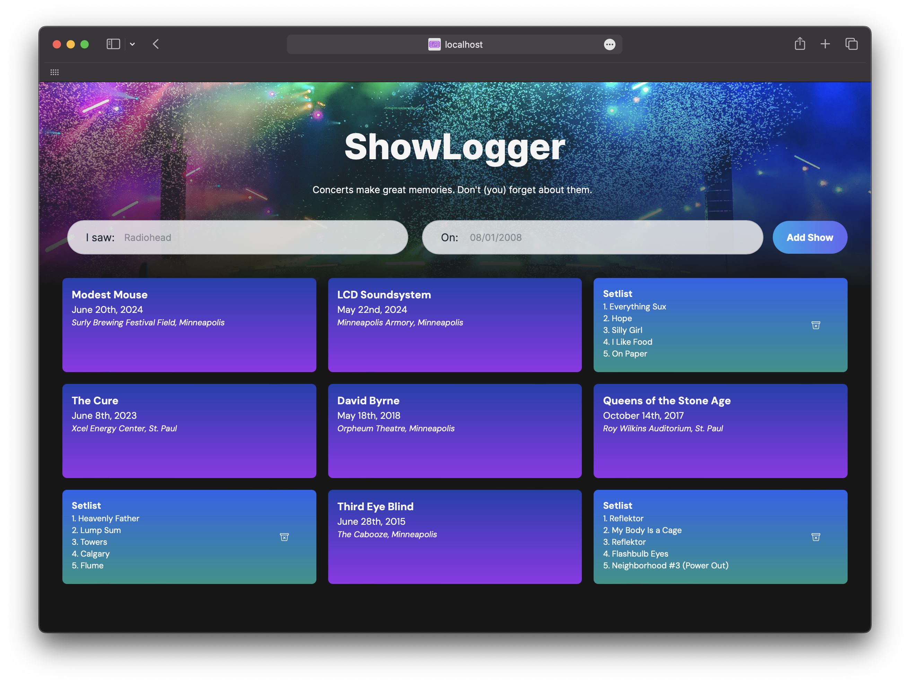

# ShowLogger: a concert folio for music lovers



## Description

This project is a front-end for a web application built with Next.js and React. Using the Setlist.fm API, it allows the user to look up past concerts and render a collection of card elements with a front side displaying general concert information, and a back side displaying the setlist from each concert. Tap or click on a generated card to flip between sides.

## Table of Contents

- [Installation](#installation)
- [Usage](#usage)
- [Considerations](#considerations)
- [Future Improvements](#future-improvements)
- [Contributing](#contributing)
- [License](#license)

## Installation

To view the live demo, visit [ShowLogger.net](http://www.showlogger.net)

To get a local development copy running:

1. Clone the repo:

   ```bash
   git clone https://github.com/bluescreenlife/livefront_showlogger
   ```

2. Navigate to the project directory:

   ```bash
   cd livefront-showlogger
   ```

3. Install dependencies:

   ```bash
   npm install
   ```

4. Run the development server:

   ```bash
   npm run dev
   ```

5. View in browser:

After starting the development server, the app will be available at `http://localhost:3000`.

## Usage

1. To add a concert, enter an artist name and date (formatted as MM/DD/YYYY) in the search fields and click Add Show, or press return.
   - Alternatively, load a set of 10 pre-set concerts by clicking the "load 10 examples" link below.
2. Click the front of a concert card to flip to the back and view the setlist (scrollable on screens larger than mobile).
3. Click the back of the card, outside of the delete icon, to return to the front.
4. To delete a concert card, click the delete icon on the back.

## Considerations

The following considerations were made during development:

- **Client-side Rendering:** To utilize hooks across multiple components, the entire site is rendered on the client side. This decision was made for simplicity and ease of state management, though it has implications for performance and SEO.
- **API requests routed through proxy server:** Due to CORS policy on the Setlist.fm API (only same-origin requests from client) from a development environment, a proxy server was used to route requests through a server component.
- **Limited search input options:** To keep the first iteration of the app simple and bug-free, the user is required to enter the date they saw the artist. Since an artist typically only plays one show on any given date, this eliminates the need for filtering and selecting results. More than likely, the user won't remember a past date off-hand and will have to look it up. Ideally, the user would enter the concert city, location, year, or a combination of these instead of the date, and a list of possible concerts would render in a drop-down selection. The Setlist.FM API only allows one requests per second, thus timeout functionality will need to be implemented to wait for the user to pause typing before a request is made.

## Future Improvements

The following is a list of improvements and feature additions for the future:

- Add additional Jest tests for API functionality via mock requests.
- Add additional search functionality including city and venue as parameters, render a menu of matches, and allow user to select a concert match.
- Improve card-flip animation on mobile: Currently, occasional artifacts are shown when flipping or scrolling concert cards (tested on Safari).
- Add sort and filter capabilities for the card grid, to better interact with large collections of concert cards.
- On desktop, if the user has scrollbars always-on in their device settings or is using Firefox with default settings, the look of the card back is distrupted by scroll bars on screens larger than mobile. A redesign with either the setlist right-aligned or displayed in a non-scrolling manner would be a notable visual improvement.
- Add user account features and concert card data storage.

## Contributing

Contributions are welcome and appreciated.

Contribution guidelines:

- Main branch: as of now, when a feature is added to main, console logs are commented out, and console errors are left in.
- Tailwind with an extension for Prettier is used for CSS and Tailwind selector organization: 'npm run format' will organize the selectors.
- Aria attributes and general accessibility helpers (i.e. labels, tab indices, onkeydown listeners) are included for screenreaders and should be maintained with addition of new features and components.

Getting started:

1. Fork the project.
2. Create your Feature Branch:

   ```bash
   git checkout -b feature/AmazingFeature
   ```

3. Commit your changes:

   ```bash
   git commit -m 'Add some great feature'
   ```

4. Push to the branch:

   ```bash
   git push origin feature/NewFeature
   ```

5. Open a Pull Request.

## License

Distributed under the MIT license.
